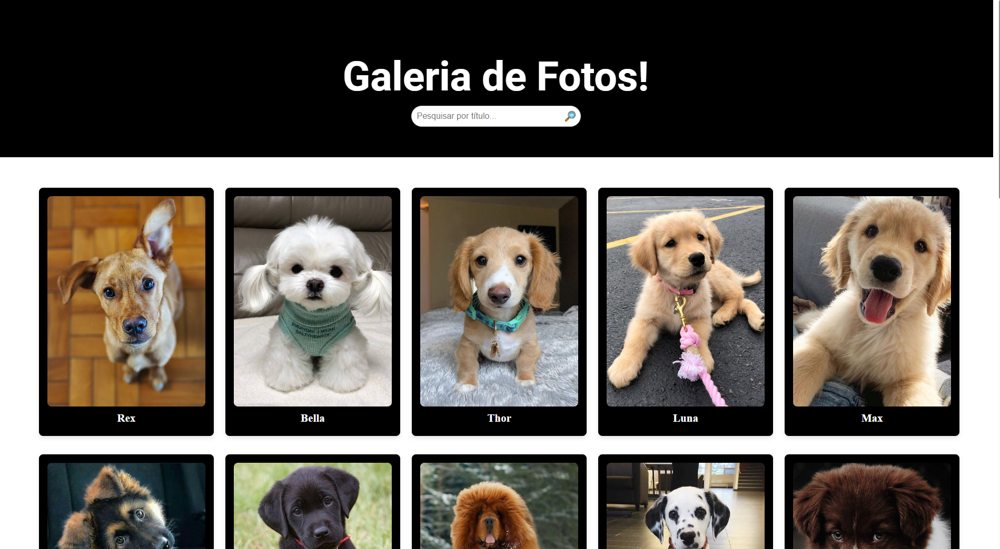
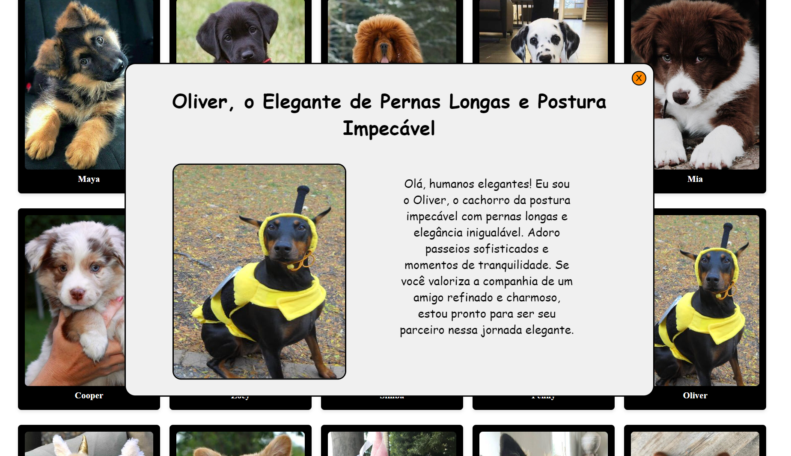
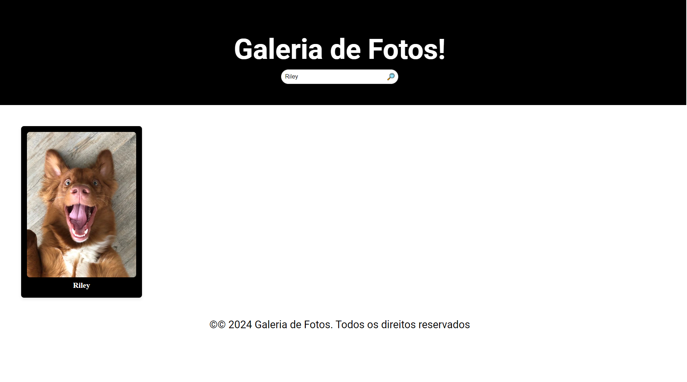
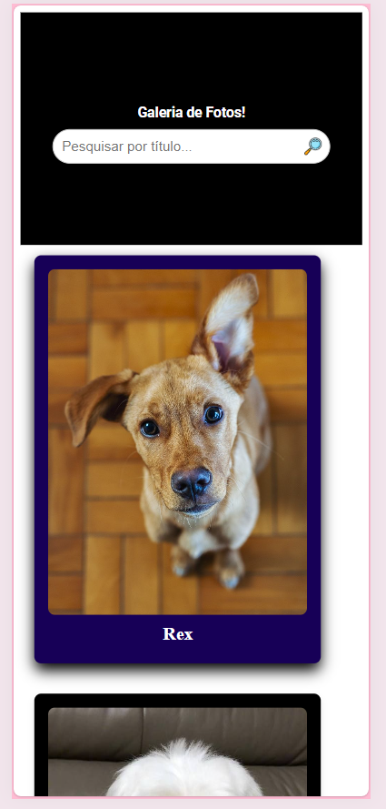
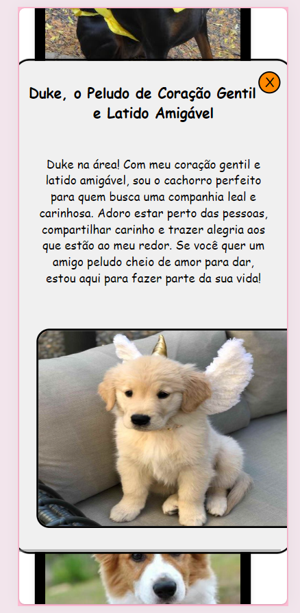
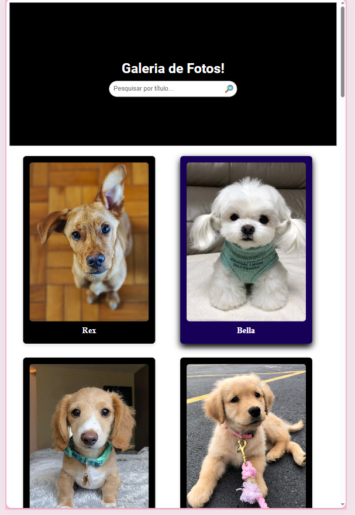
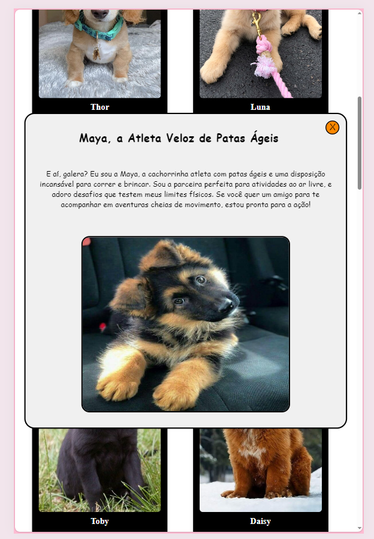

# Galeria de Fotos 🖼️

Bem-vindo a  minha **Galeria de Fotos**, um site simples e responsivo desenvolvido em HTML, CSS e JavaScript para exibir fotos com informações detalhadas de cada imagem. 

## 📋 Funcionalidades

- **Exibição de Imagens**: As fotos são organizadas em um grid responsivo.

     

|----------------------------------|-----------------------------------|

- **Detalhes das Fotos**: Ao clicar em uma imagem, uma modal é exibida com informações adicionais.

    

|----------------------------------|-----------------------------------|

- **Pesquisa Dinâmica**: Permite buscar imagens pelo título usando o campo de pesquisa.

    

|----------------------------------|-----------------------------------|

- **Design Responsivo**: O layout se adapta a diferentes tamanhos de tela, incluindo desktops, tablets e celulares. Exemplo de celular e tablet:

     
  
    
  

---

## 🚀 Tecnologias Utilizadas

- **HTML5**: Estruturação do conteúdo.
- **CSS3**: Estilização, incluindo animações e design responsivo.
- **JavaScript**: Interatividade, como pesquisa e exibição de modais.

---

## 📂 Estrutura do Projeto

O projeto está estruturado em três arquivos principais:

- **index.html**: Contém a estrutura da página, como o cabeçalho, a galeria de imagens e os modais.
- **style.css**: Responsável pelo estilo e layout da página, definindo cores, espaçamentos e animações.
- **script.js**: Contém as funcionalidades de pesquisa, abertura e fechamento dos modais.

## 🎨 Design

O design deste projeto foi feito pensando na funcionalidade e experiência do usuário, priorizando uma interface intuitiva, atraente e responsiva. Adotou-se um estilo minimalista, com layout limpo e uso eficiente de espaços em branco.

Para as cores, escolhi uma paleta neutra, com tons suaves que proporcionam um contraste adequado e não sobrecarregam a visão. Isso cria um ambiente visual confortável e profissional, reforçando a identidade do projeto. Além disso, os detalhes em cores de destaque foram utilizados para guiar a atenção do usuário, como no botão de fechar o modal e nos elementos interativos.

A responsividade foi uma prioridade, com um grid que permite à galeria ajustar-se dinamicamente a diferentes tamanhos de tela, garantindo uma experiência consistente em dispositivos móveis, tablets e desktops. Animações suaves foram escolhidas para as transições no modal, equilibrando funcionalidade e estética para uma experiência fluida e agradável.

